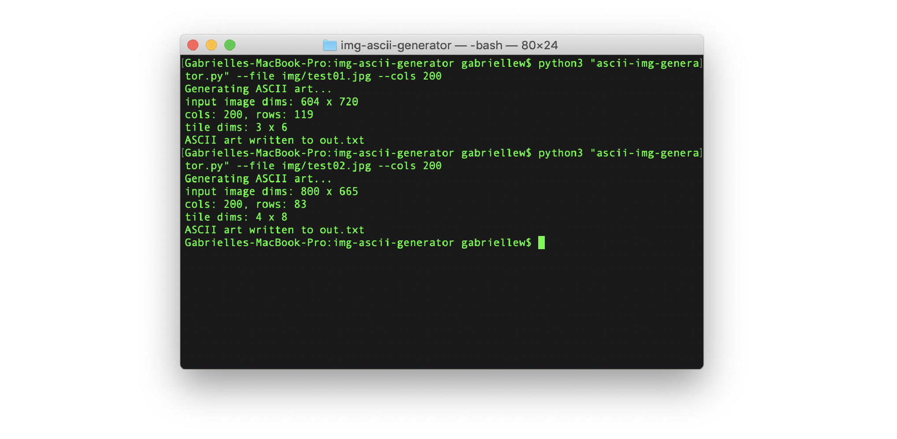

# img-ascii-generator
Converts images into ASCII text artwork.

## Requirements
- [Python 3.x.x](https://www.python.org/downloads/release/python-373/) (tested with 3.6)
- Python packages: [Pillow](https://pillow.readthedocs.io/en/stable/), [NumPy](https://www.numpy.org/)
- A terminal emulator
- A .png or .jpg image for conversion

## How to Use
```
  $ python3 "ascii-img-generator" --file img/test02.jpg --cols 140
```

## Usage
```
Usage:
  python3 ./ascii-img-generator --file [IMGFILE] --scale [SCALE] --out [OUTFILE.txt] --cols [COLS]

Arguments:
  --help, -h          Show this screen
  --file    IMGFILE   Name of input image file
  --scale   SCALE     Scale value for the ascii text (optional)
  --out     OUTFILE   Name of output file for the ascii text (optional)
  --cols    COLS      Number of columns for the ascii text
```

##  License
This project is licensed under the MIT License - see the LICENSE.md file for details.
